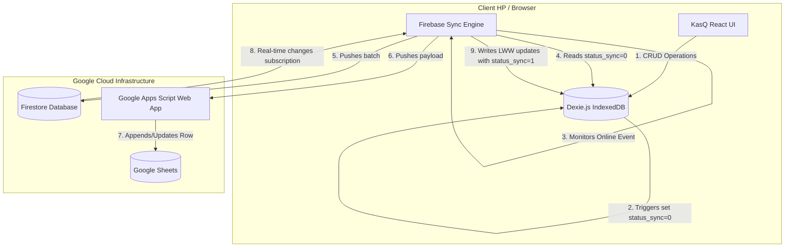

# Panduan Sinkronisasi Realtime & Offline-First KasQ

Dokumen ini menjelaskan arsitektur dan alur kerja sinkronisasi data pada KasQ, menggunakan **IndexedDB (Dexie.js)** untuk penyimpanan offline lokal, **Firebase Firestore** untuk database awan realtime, dan **Google Sheets** via **Google Apps Script** untuk pelaporan realtime gratis.

---

## 1. Arsitektur Sinkronisasi (Architecture Overview)



---

## 2. Alur Kerja Sinkronisasi (Data Flow Sync)

### A. Penyimpanan Lokal & Otomatisasi Status (Offline Write)
Setiap kali pengguna melakukan operasi tambah (insert), ubah (update), atau hapus (delete) pada antarmuka aplikasi:
1. Data langsung ditulis ke **IndexedDB** lokal melalui query Dexie.js (respons super cepat < 200ms).
2. **Database Hooks** di [db.service.js](file:///var/www/html/kasQ/src/services/db.service.js#L26) secara otomatis menangkap operasi tersebut:
   * **Insert / Update**: Menambahkan field `status_sync: 0` (belum tersinkronisasi) dan `updatedAt: Timestamp` ke dalam objek data.
   * **Delete**: Memasukkan data ke tabel `tombstones` dengan status `status_sync: 0` agar penghapusan di cloud bisa dilakukan secara berjadwal.

### B. Sinkronisasi ke Cloud (Local-to-Cloud)
Ketika aplikasi mendeteksi status **Online**:
1. Fungsi `syncLocalToCloud` di [firebase.service.js](file:///var/www/html/kasQ/src/services/firebase.service.js#L30) membaca semua data yang memiliki `status_sync: 0` dari tabel `products`, `transactions`, `debts`, dan `materials`.
2. Data tersebut dikirim ke **Firestore** secara berkelompok menggunakan `writeBatch` untuk menghemat jatah kuota baca/tulis Firebase.
3. Secara bersamaan, data dikirim via request HTTP POST ke **Google Apps Script Web App** untuk dimasukkan ke tab Google Sheets yang sesuai.
4. Setelah cloud merespon sukses, status lokal diubah menjadi `status_sync: 1`.

### C. Pembaruan Realtime dari Cloud (Cloud-to-Local)
Aplikasi berlangganan perubahan data di Firestore secara realtime menggunakan WebSocket (`onSnapshot`):
1. Ketika ada perubahan data di Firestore oleh perangkat lain atau admin:
   * Jika data dihapus di cloud, data lokal dihapus.
   * Jika data diubah, bandingkan timestamp `updatedAt` (mekanisme **Last-Write-Wins**). Jika data cloud lebih baru, data lokal diperbarui.
2. Selama sinkronisasi cloud-to-local ini, flag global `isSyncingFromCloud` diaktifkan agar database hooks lokal tidak berjalan, mencegah terjadinya loop sinkronisasi tak berujung.

---

## 3. Resolusi Konflik (Conflict Resolution)

KasQ menerapkan strategi **Last-Write-Wins (LWW)** di tingkat properti/field data.
* Setiap baris memiliki penanda waktu `updatedAt`.
* Jika terjadi konflik (perubahan bersamaan saat offline), data dengan `updatedAt` terbaru di server yang akan dipertahankan saat sinkronisasi berjalan kembali.

---

## 4. Setup Google Apps Script Web App

Agar Google Sheets terupdate otomatis tanpa membutuhkan server berbayar (Plan Blaze Firebase), gunakan Google Apps Script:

1. Buka Google Sheet target, klik **Extensions** -> **Apps Script**.
2. Tempel kode webhook berikut:
```javascript
function doPost(e) {
  try {
    var payload = JSON.parse(e.postData.contents);
    
    // Support both single item (backward compatibility) and batch array
    var operations = [];
    if (payload.items) {
      operations = payload.items;
    } else {
      operations = [payload];
    }
    
    var ss = SpreadsheetApp.getActiveSpreadsheet();
    
    for (var opIdx = 0; opIdx < operations.length; opIdx++) {
      var op = operations[opIdx];
      var sheetName = op.sheetName;
      var action = op.action;
      var docId = op.docId;
      var data = op.data;
      var headers = op.headers;

      var sheet = ss.getSheetByName(sheetName);
      if (!sheet) {
        sheet = ss.insertSheet(sheetName);
        sheet.appendRow(headers);
      }

      var rows = sheet.getDataRange().getValues();
      var rowIndex = -1;
      for (var i = 0; i < rows.length; i++) {
        if (String(rows[i][0]) === String(docId)) {
          rowIndex = i + 1;
          break;
        }
      }

      if (action === 'remove') {
        if (rowIndex !== -1) {
          sheet.deleteRow(rowIndex);
        }
      } else {
        var rowValues = headers.map(function(h) {
          if (h === 'id') return String(docId);
          return data[h] !== undefined ? String(data[h]) : '';
        });
        if (rowIndex !== -1) {
          var range = sheet.getRange(rowIndex, 1, 1, headers.length);
          range.setValues([rowValues]);
        } else {
          sheet.appendRow(rowValues);
        }
      }
    }
    return ContentService.createTextOutput("Success").setMimeType(ContentService.MimeType.TEXT);
  } catch (err) {
    return ContentService.createTextOutput("Error: " + err.toString()).setMimeType(ContentService.MimeType.TEXT);
  }
}
```
3. Klik **Deploy** -> **New Deployment** -> Pilih tipe **Web App**.
4. Set **Execute as** ke `Me` dan **Who has access** ke `Anyone`.
5. Salin URL Web App yang dihasilkan, masukkan ke [.env](file:///var/www/html/kasQ/.env) sebagai `VITE_GOOGLE_SCRIPT_URL`.

---

## 5. Troubleshooting & Tips
* **Data tidak terupdate di Google Sheet?**
  * Periksa apakah URL Web App di [.env](file:///var/www/html/kasQ/.env) sudah sesuai.
  * Pastikan akses deployment Apps Script disetel ke **Anyone** (bukan *Anyone with Google account*).
  * Pastikan browser dalam keadaan Online. Indikator status dapat dilihat pada banner [HeaderStatus.jsx](file:///var/www/html/kasQ/src/components/HeaderStatus.jsx).
